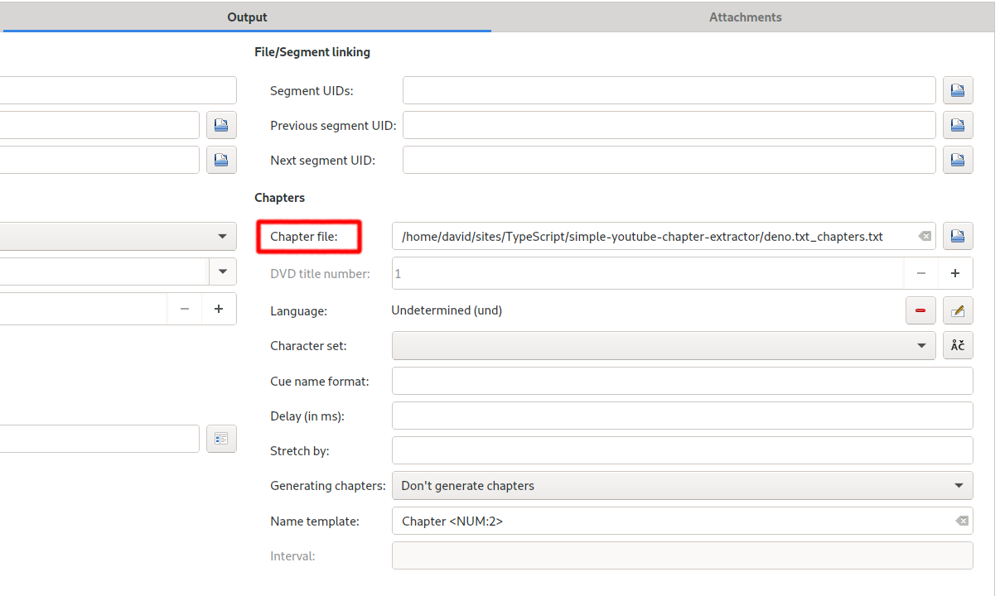

# Simple YouTube Chapter Extractor

Copy the text containing chapter information directly from YouTube and convert it into [simple mkvmerge chapter format](https://mkvtoolnix.download/doc/mkvmerge.html#mkvmerge.chapters) to embed in your downloaded YouTube video.

# Requirements

- [Deno](https://deno.land/) installed (tested on 1.5.3)
- `mkvmerge` command line tool or `MKVToolNix GUI` installed

# Installation

## Install or update:

```
deno install -Af https://deno.land/x/simple_youtube_chapter_extractor@v1.0.0/youtube-chapter-extractor.ts
```

## Uninstall

https://github.com/denoland/deno/issues/3139

`rm $(which youtube-chapter-extractor)`

# Usage

- Find a video that uses the recent YouTube chapters feature:


- You can download YouTube videos using [youtube-dl](https://youtube-dl.org/) or one of many browser extensions
- Under the video in the description there should be text including chapters. Copy and paste all the text into a file for use with this program. It might look like:

```
⭐️ Course Contents ⭐️
Introduction
---------------------
⌨️ (00:00:00) Introduction
⌨️ (00:02:02) Course overview
⌨️ (00:04:38) Course Project
⌨️ (00:05:51) What is Deno
⌨️ (00:08:19) Course project (Survey app) demo
⌨️ (00:11:54) Install and Getting started
⌨️ (00:14:34) Write "Hello World"
⌨️ (00:15:50) Main Features
```

# Text file source formats allowed

YouTubers can create the list of chapters in any way they like, the following are some common ones supported:

The time stamp in either `00:00` or `00:00:00` format followed by either:

`space` `title`:

```
03:00:00 Introduction
```

`)` `space` `title`:

```
⌨️ (00:00:00) Introduction
```

`space` `-` `space` `title`

```
02:00 - Introduction
```

The current regex used is:

`/(?<time>\d{2}:\d{2}:\d{2}|\d{2}:\d{2})\)?\s(\-)?(\s)?(?<chapterTitle>.*)/g;`.

To see what it does paste it into [regex101.com](https://regex101.com/). Please contribute more formats to help others use this program!

## Extract chapters from text file

```
youtube-chapter-extractor [name of text file to process]
```

or if you did not install it and running from source file:

```
./youtube-chapter-extractor.ts [name of text file to process]
```

## Merge chapters into video file

- Use `MKVToolNix GUI` which contains all the functionality of `mkvmerge`



or

- Download `mkvmerge` from [the home site](https://mkvtoolnix.download/downloads.html) and use:

```
mkvmerge \
  --chapters originalfilename_chapters.txt \
  -o output-file.mkv \
  input-file.mkv
```

or

- [Flathub](https://flathub.org/apps/details/org.bunkus.mkvtoolnix-gui) and use:

```
flatpak run --command=mkvmerge org.bunkus.mkvtoolnix-gui --chapters originalfilename_chapters.txt -o output-file.mkv input-file.mkv
```

# Development

`deno test` to run tests.

`deno --unstable lint youtube-chapter-extractor.ts` to lint.

## Suggested contributions

- Add more text chapter formats
- Add more tests
- Automate `mkvmerge` usage
- Automate `youtube-dl` chapter extraction from JSON file. The feature is currently broken in `2020.11.17`, `youtube-dl --write-info-json` results in `"chapters": null`

## Suggested things not to bother with

- Automating everything using the YouTube API. It has been done by https://github.com/gabrielfroes/youtube-chapter-extractor, and it seems to keep breaking and be too complex.

# The future of video sharing

The future of video sharing is federated peer to peer, we must be free to express ourselves without corporate or government censorship. Have a look at https://joinpeertube.org/.

# FAQ

**Q**: Is it possible to save as XML?

**A**: You can use chapterEditor for those who are interested.

https://forum.doom9.org/showthread.php?t=169984

https://www.videohelp.com/software/chapterEditor

Just drag the text file generated by simple-youtube-chapter-extractor into chapterEditor and use Save as
https://i.imgur.com/mcmRMny.png

**Q**: Any other solutions?

**A**: Try https://github.com/yt-dlp/yt-dlp/ and `yt-dlp --embed-chapters [URL]`
